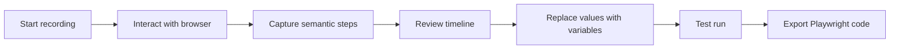

<div align="center">

# BrowserFlow Recorder

**Record browser actions, review every step, and export maintainable Playwright automation.**

[](ROADMAP.md)
[](#planned-output)
[](#planned-output)
[](https://github.com/xinjian0101/browserflow-recorder/issues)
[](https://github.com/xinjian0101/browserflow-recorder/commits)

</div>

> [!NOTE]
> BrowserFlow Recorder is currently in the design stage. The first executable recorder has not been released. This repository documents intended behavior and release gates.

## About

BrowserFlow Recorder is planned as a local-first visual recorder that converts ordinary browser interactions into inspectable Playwright workflows. Users will be able to record clicks, typing, navigation, waits, and assertions, then edit the resulting flow before exporting code.

The product will prioritize maintainability over one-time recording success. Generated selectors, waits, variables, and retry rules must remain visible and editable.

## Why this project

Recorded browser scripts are often difficult to maintain because they rely on unstable selectors or hide important assumptions. BrowserFlow Recorder will separate recording, review, parameterization, test execution, and export so users can understand the workflow before running it.

## Planned workflow



## Planned capabilities

- Record clicks, text input, navigation, select controls, uploads, downloads, and waits.
- Prefer role, label, placeholder, and test-id selectors over fragile coordinates.
- Show a screenshot and selector explanation for every captured step.
- Reorder, disable, duplicate, group, and annotate steps.
- Convert repeated values into variables and environment references.
- Add assertions for URL, text, visibility, download, and response state.
- Run flows locally with bounded retries and failure screenshots.
- Export TypeScript and Python Playwright projects.
- Import CSV or JSON rows for controlled batch execution.
- Generate optional continuous-integration examples.

## Responsible-use boundaries

- Workflows should only automate systems the user is authorized to use.
- Sensitive values should be replaced with local configuration references before export.
- Destructive actions require explicit review and should be disabled during preview runs.
- Generated workflows remain subject to site terms, organizational policy, and applicable law.

## Planned output

```text
browserflow-project/
├── flow.browserflow.json
├── playwright.config.ts
├── tests/recorded-flow.spec.ts
├── fixtures/data.example.json
├── .env.example
└── README.md
```

## Product status

| Area | State |
|---|---|
| Recording event model | Planned |
| Recorder bridge | Planned |
| Visual timeline editor | Planned |
| Playwright TypeScript exporter | Planned |
| Playwright Python exporter | Planned |
| Local runner and reports | Planned |

See [ABOUT.md](ABOUT.md) for positioning and [ROADMAP.md](ROADMAP.md) for release gates.

## Contributing

Early proposals should focus on event schemas, selector ranking, value handling, failure diagnostics, accessibility, and reproducible exports. Include a minimal example and explain why the proposed behavior will remain stable across page changes.

## Relationship to Playwright

This is an independent companion project. It is not maintained by or officially affiliated with Microsoft or the Playwright project. Any upstream code use will preserve applicable copyright and license notices.

## License

A project license will be finalized before executable source is published. Third-party notices will be included with the first code release.